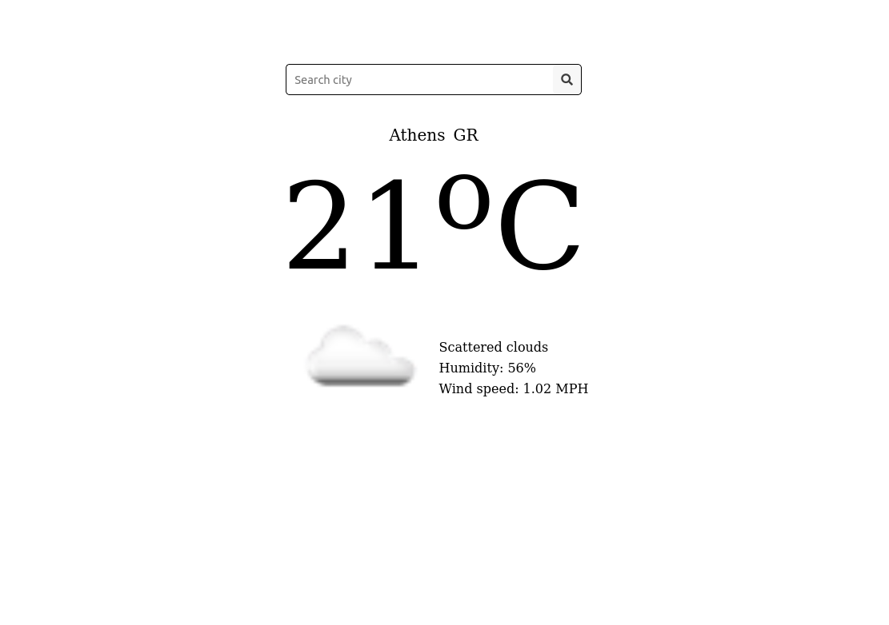

# weatherApp

A weather app that pulls from the OpenWeatherMap API to allow users to view the forecast in 
cities worldwide.

## [Live Link](https://patrick-angelos.github.io/weather_private/)

## Built With

- JavaScript
- CSS

## Getting Started

To set up a local copy of the project

- `git clone git@github.com:patrick-angelos/weatherApp.git`
- `cd weather`
- `npm install` to install dependencies
- create an env.js file in the dist folder
- create a variable in the env.js file `WeatherKey = '...'`

## Author

👤 **Patrikis Angelos**

- GitHub: [@patrick-angelos](https://github.com/patrick-angelos)
- Twitter: [@AngelosPatrikis](https://twitter.com/AngelosPatrikis)
- LinkedIn: [Angelos Patrikis](https://www.linkedin.com/in/angelos-patrikis-a590a61b5/)

## 🤝 Contributing

Contributions, issues, and feature requests are welcome!

## Show your support

Give a ⭐️ if you like this project!

## Acknowledgments

- To Microverse for their `README` template.

## 📝 License

MIT License